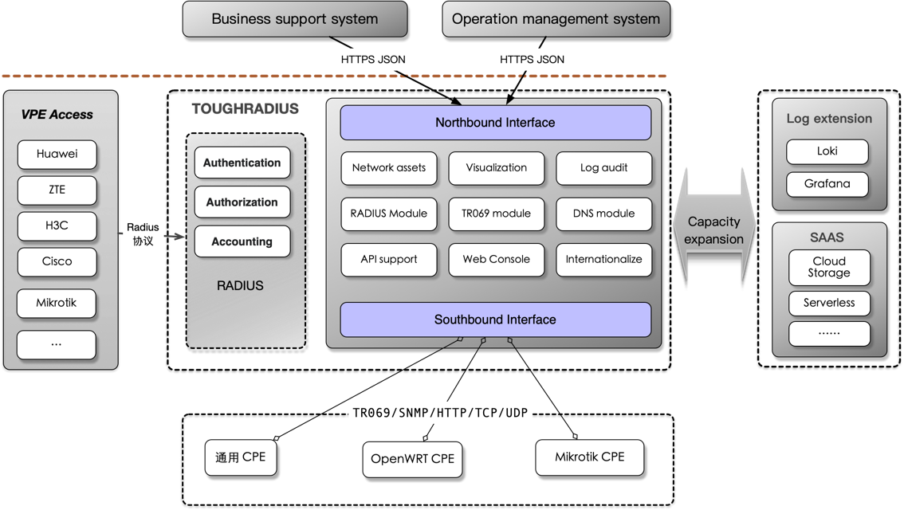

Welcome to the TOUGHRADIUS project!

     _____   _____   _   _   _____   _   _   _____        ___   _____   _   _   _   _____  
    |_   _| /  _  \ | | | | /  ___| | | | | |  _  \      /   | |  _  \ | | | | | | /  ___/ 
      | |   | | | | | | | | | |     | |_| | | |_| |     / /| | | | | | | | | | | | | |___  
      | |   | | | | | | | | | |  _  |  _  | |  _  /    / / | | | | | | | | | | | | \___  \ 
      | |   | |_| | | |_| | | |_| | | | | | | | \ \   / /  | | | |_| | | | | |_| |  ___| | 
      |_|   \_____/ \_____/ \_____/ |_| |_| |_|  \_\ /_/   |_| |_____/ |_| \_____/ /_____/ 

# TOUGHRADIUS

TOUGHRADIUS is committed to providing comprehensive and superior network management solutions.
The core technology is based on RADIUS and can extend the system functions to support various network protocols, such as TR069.
TOUGHRADIUS not only provides a user-friendly system interface, but also powerful data analysis and management features such as real-time network monitoring, usage reports and automatic billing. TOUGHRADIUS is dedicated to providing secure, reliable and efficient network management services, enabling them to realize more efficient network operations.

TOUGHRADIUS uses advanced Golang technology to develop the system core, providing excellent system performance and easy deployment experience.

## Quick Install

[quick Start](https://github.com/talkincode/toughradius/wiki/quickstart)

- Use curl 

```bash
sudo bash -c "$(curl -fsSL https://raw.githubusercontent.com/talkincode/toughradius/main/installer.sh)"
```

- Use wget

```bash
sudo bash -c "$(wget https://raw.githubusercontent.com/talkincode/toughradius/main/installer.sh -O -)"
```


## Q&A AiBot

ToughRadius provides an AI-based technical service bot that we hope can help you solve some technical problems.


[A&A AiBot Link](https://qa.toughradius.net/)

## System structure




## System features

### TR069 ACS

TR069 ACS can provide real-time monitoring and maintenance of CPE devices in the network to ensure their normal operation. It supports multiple data models and allows custom Settings to accommodate different types of CPE devices. In addition, TR069 ACS also supports secure encryption to protect data privacy and security. Therefore, TR069 ACS not only improves the efficiency of network management, but also ensures network security.

- Configure or get device configuration parameters and operating status
- Provide vendor device configuration download
- Provide device factory reset configuration download
- Provide upgrade firmware download

### Radius Server

TOUGHRADIUS is a RADIUS server that supports the RADIUS protocol and the RADIUS over TLS (RadSec) protocol.

Standard RADIUS features

- Authentication message
- Authentication PAP authentication method
- Authentication CHAP authentication method
- Authentication MS-CHAPv2 authentication method
- Authorization message

  > After receiving the BAS Authentication request message, the RADIUS Server encapsulates the user authorization information according to the user information resources, and authorizes the user bandwidth limit, maximum duration, IP and other information to the BAS through the Authentication response message.

- Accounting-On message
- Accounting-Off message
- Accounting-Start message
- Accounting-Interium-Update message
- Accounting-Stop message
- Deliver the SessionTimeout attribute
- Deliver the AcctInterimInterval attribute
- Deliver the FramedPool attribute
- Deliver the FramedIPAddress attribute
- Deliver attributes of the customized vendor，such as Huawei, ZTE, Cisco，Mikrotik etc.

#### freeRADIUS integration


TOUGHRADIUS integrates with the FreeRADIUS API interface, extending its already comprehensive authentication capabilities to provide a more robust solution.
Integration with the FreeRADIUS API enables seamless integration with existing network infrastructures, providing a wider range of authentication options to meet unique requirements.
Whether you need to support 802.1X, Wi-Fi, VPNs or other network access protocols, TOUGHRADIUS has you covered. With advanced authentication capabilities and integration with FreeRADIUS, users can enjoy a secure, reliable and efficient network management experience.

### Northbound Interface

- Provide a unified API for various third-party management systems, based on the HTTPS Json protocol.
- Provide basic equipment information and status data query API, and data maintenance API.
- Provide various policy management APIs, such as firewall rules, routing tables, etc.

## Links

- [Home](https://www.toughradius.net/)
- [TOUGHRADIUS Documentation](https://github.com/talkincode/toughradius/wiki)
- [TLS encryption for RADIUS over TCP (RadSec) 00)](https://tools.ietf.org/id/draft-ietf-radext-radsec-00.html)
- [TLS encryption for RADIUS over TCP (RadSec) 05](https://tools.ietf.org/html/draft-ietf-radext-radsec-05)
- [mikrotik RADIUS Client](https://wiki.mikrotik.com/wiki/Manual:RADIUS_Client)

# Contribute

We welcome contributions of any kind, including but not limited to issues, pull requests, documentation, examples, etc.

