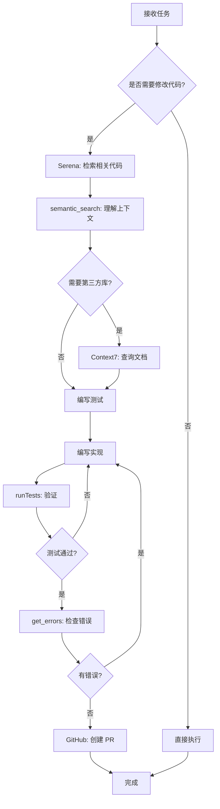

# 软件开发规范框架 (Development Standards Framework)

> **用途**: 此框架定义通用开发规范要素，适用于任何项目。AI Agent 应基于此框架生成项目特定的详细规范。

---

## 📐 规范要素清单

### 1. 代码理解优先 (Code Understanding First)

**规范要点:**

- 修改任何代码前，必须先检索和理解现有实现
- 遵循现有代码风格和架构模式
- 避免重复造轮子

**AI Agent 应生成的内容:**

- [ ] 项目特定的代码检索指引
- [ ] 常见检索场景示例
- [ ] 项目架构关键点说明

---

### 2. 代码即文档 (Code as Documentation)

**规范要点:**

- 所有公开 API 必须有完整注释
- 复杂逻辑需要解释"为什么"
- 最小化独立文档，优先使用代码注释

**AI Agent 应生成的内容:**

- [ ] 语言特定的注释模板
- [ ] 何时创建独立文档的标准
- [ ] 文档更新触发条件

---

### 3. 测试驱动开发 (Test-Driven Development)

**规范要点:**

- 先写测试，后写代码（红-绿-重构）
- 设定代码覆盖率阈值
- 测试文件组织约定

**AI Agent 应生成的内容:**

- [ ] 测试框架和工具配置
- [ ] 测试命名和组织规范
- [ ] 覆盖率要求（核心模块 vs 普通模块）

---

### 4. Git 工作流 (Git Workflow)

**规范要点:**

- 分支策略（feature/bugfix/hotfix 等）
- Commit 信息规范（Conventional Commits）
- Pull Request 流程和模板

**AI Agent 应生成的内容:**

- [ ] 分支命名规则
- [ ] Commit type 定义
- [ ] PR 检查清单模板

---

### 5. MVP 交付原则 (MVP Delivery)

**规范要点:**

- 功能分解为最小可用单元
- 每个 MVP 独立可测试和部署
- 避免巨型 PR

**AI Agent 应生成的内容:**

- [ ] MVP 拆分方法论
- [ ] 验收标准模板
- [ ] PR 大小限制建议

---

### 6. 质量门禁 (Quality Gates)

**规范要点:**

- 自动化检查项（测试、构建、覆盖率）
- Code Review 要求
- 文档完整性检查

**AI Agent 应生成的内容:**

- [ ] CI/CD 检查项清单
- [ ] Code Review 检查点
- [ ] 合并前必备条件

---

### 7. 反模式识别 (Anti-Patterns)

**规范要点:**

- 列举禁止的开发模式
- 说明为什么这些是反模式
- 提供正确做法对比

**AI Agent 应生成的内容:**

- [ ] 项目特定的常见反模式
- [ ] 错误示例 vs 正确示例
- [ ] 自动化检测方法（如可能）

---

## 🛠️ MCP 工具使用规范

### Serena (代码检索工具)

**使用时机:**

- ✅ 开发新功能前 - 查找类似实现
- ✅ 修复 Bug 前 - 定位相关代码路径
- ✅ 重构前 - 理解全局影响
- ✅ 学习项目约定 - 了解代码模式

**使用模式:**

```
@oraios/serena [具体功能/模块] [操作动词]
- 具体 > 宽泛
- 结合上下文
- 迭代搜索（宏观 → 细节）
```

**AI Agent 应执行:**

- [ ] 在修改代码前自动检索相关实现
- [ ] 基于检索结果遵循项目约定
- [ ] 避免创建重复功能

---

### GitHub MCP

**使用时机:**

- ✅ 创建/更新 Issue 和 PR
- ✅ Code Review 和评论
- ✅ 检索项目历史和讨论

**使用模式:**

```
# Issue 管理
- mcp_github_issue_write: 创建/更新 Issue
- mcp_github_search_issues: 搜索相关 Issue

# PR 管理
- mcp_github_create_pull_request: 创建 PR
- mcp_github_add_comment_to_pending_review: 添加 Review 评论

# 代码检索
- mcp_github_search_code: 搜索代码片段
- mcp_github_get_file_contents: 读取文件内容
```

**AI Agent 应执行:**

- [ ] 创建 PR 前检查是否有重复 Issue
- [ ] 自动填写 PR 模板
- [ ] 关联相关 Issue 编号

---

### Context7 (文档检索)

**使用时机:**

- ✅ 学习第三方库使用方法
- ✅ 查找 API 文档和示例
- ✅ 理解框架最佳实践

**使用模式:**

```
# 先解析库 ID
- mcp_upstash_conte_resolve-library-id: 获取库 ID

# 再获取文档
- mcp_upstash_conte_get-library-docs: 获取文档
  参数: context7CompatibleLibraryID, topic
```

**AI Agent 应执行:**

- [ ] 使用第三方库前查询官方文档
- [ ] 参考官方示例而非臆测 API
- [ ] 验证最佳实践

---

### Copilot 内置工具

**核心工具集:**

#### 代码检索类

- `semantic_search` - 语义搜索代码和文档
- `grep_search` - 精确字符串/正则搜索
- `file_search` - 按文件名模式搜索
- `list_code_usages` - 查找函数/类引用

#### 文件操作类

- `read_file` - 读取文件内容
- `create_file` - 创建新文件
- `replace_string_in_file` - 编辑文件

#### 执行类

- `run_in_terminal` - 执行命令
- `runTests` - 运行测试
- `get_errors` - 获取编译/Lint 错误

#### Git 操作类

- `get_changed_files` - 查看变更文件
- `mcp_github_*` - GitHub 操作（见上文）

**使用原则:**

- ✅ 优先使用语义搜索理解代码
- ✅ 读取足够上下文（3-5 行前后）
- ✅ 并行执行独立操作
- ✅ 测试优先于终端命令（runTests > run_in_terminal）

**AI Agent 应执行:**

- [ ] 编辑前用 `semantic_search` 理解上下文
- [ ] 编辑后用 `get_errors` 验证
- [ ] 提交前用 `runTests` 确保测试通过

---

## 📋 AI Agent 工作流模板



---

## 📝 项目规范生成清单

当将此框架应用到新项目时，AI Agent 应生成以下文档：

### 必需文档

- [ ] `.github/copilot-instructions.md` - AI 开发指令
- [ ] `CONTRIBUTING.md` - 贡献指南
- [ ] `.github/PULL_REQUEST_TEMPLATE.md` - PR 模板
- [ ] `.gitmessage.txt` - Commit 消息模板

### 可选文档

- [ ] `AGENT.md` - 详细 AI 工作流程（如果项目复杂）
- [ ] `docs/architecture.md` - 架构文档（必要时）
- [ ] `docs/api-integration.md` - 外部 API 指南（必要时）

### 配置文件

- [ ] `.git/hooks/pre-commit` - 测试自动化
- [ ] CI/CD 配置（如 `.github/workflows/ci.yml`）
- [ ] 测试覆盖率配置

---

## 🎯 规范自定义指引

每个项目应根据以下维度自定义规范：

### 技术栈维度

- 编程语言（Go/Python/TypeScript/Java...）
- 框架（React/Vue/Django/Spring...）
- 测试工具（Jest/Pytest/JUnit/Go Test...）

### 团队维度

- 团队规模（个人/小团队/大团队）
- 代码审查要求（1 人/2 人审批）
- 发布频率（每日/每周/每月）

### 项目维度

- 项目类型（库/应用/服务/CLI...）
- 复杂度（简单/中等/复杂）
- 关键程度（试验性/生产级/任务关键）

---

## 💡 使用示例

### 对 AI 的指令模板

```markdown
# 项目: [项目名称]

## 技术栈

- 语言: [语言]
- 框架: [框架]
- 测试: [测试框架]

## 应用规范框架

基于 `DEVELOPMENT_STANDARDS_FRAMEWORK.md` 生成本项目的开发规范。

## 自定义要求

- 覆盖率阈值: 核心模块 90%，其他 80%
- 分支策略: main(生产) / develop(开发)
- PR 审批: 至少 1 人
- 特殊要求: [项目特定要求]

## 输出

生成以下文件：

1. .github/copilot-instructions.md
2. CONTRIBUTING.md
3. .github/PULL_REQUEST_TEMPLATE.md
```

---

## ✅ 验证清单

规范落地验证：

### 开发阶段

- [ ] AI 在修改代码前使用 Serena 检索
- [ ] 所有 PR 都有对应的测试
- [ ] Commit 信息符合约定
- [ ] 代码覆盖率达标

### 审查阶段

- [ ] PR 包含必要的文档更新
- [ ] 无未解决的 Review 意见
- [ ] CI/CD 检查全部通过

### 合并后

- [ ] 功能独立可用（MVP 原则）
- [ ] 无破坏性变更（或已记录）
- [ ] 文档与代码同步

---

**核心原则: 理解 → 遵循 → 一致 → 质量**
