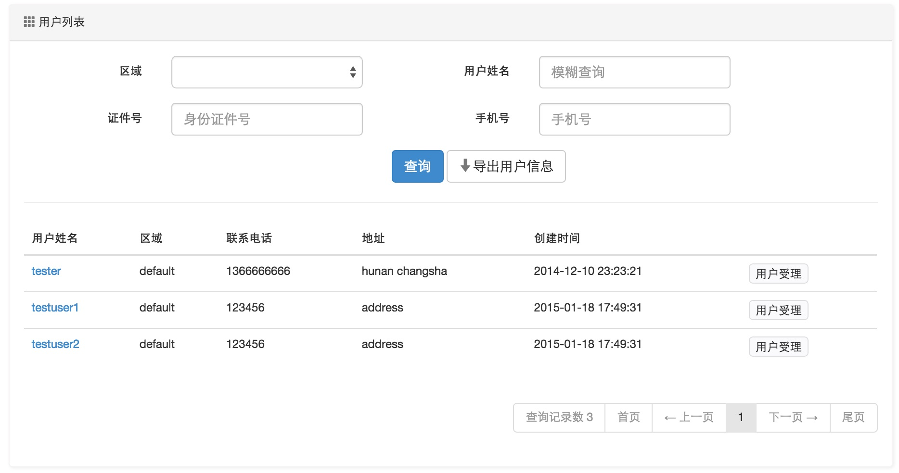
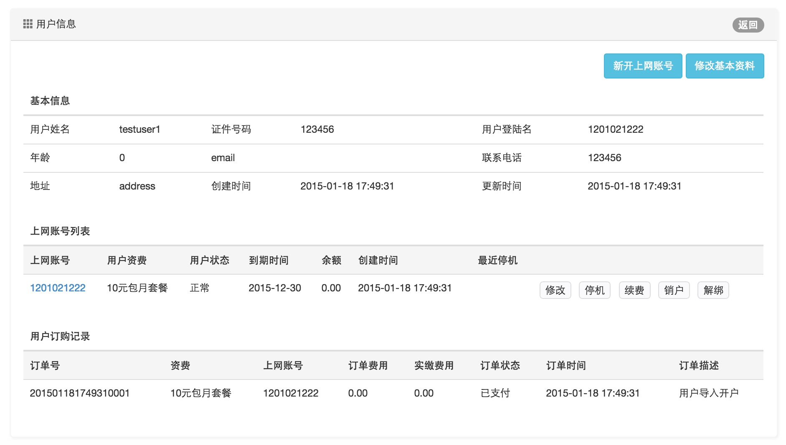
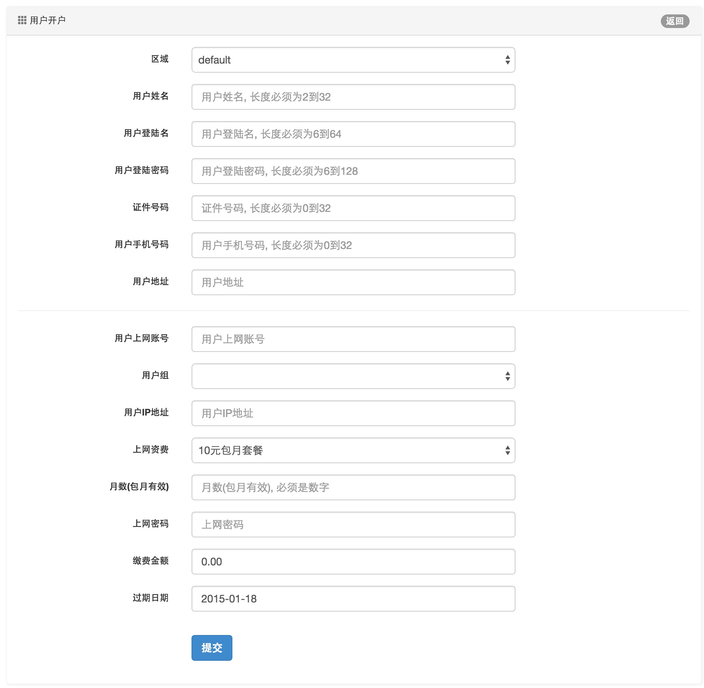
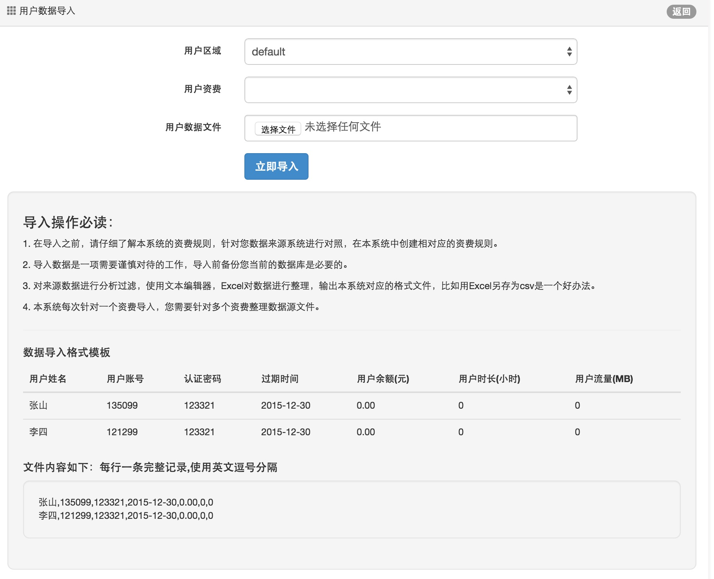
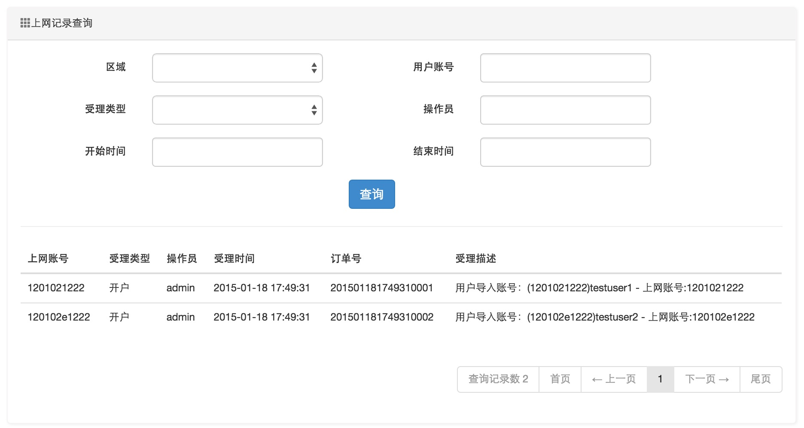

营业管理功能
====================================

用户信息管理
--------------------------

根据条件快速查询用户列表,提供快速受理按钮进入用户受理界面。以及提供用户信息导出下载为Excel文件。

支持的查询条件：区域，用户姓名，证件号码，手机号

*查询界面*：

用户受理
--------------------------

通过用户列表的用户受理按钮即可进入用户详情界面，根据用户受理类型进入具体受理操作。

*用户详情界面*：

用户快速开户
--------------------------

用户快速开户会建立新的用户基本资料以及一个上网账号

表单填写说明：

- 区域：用户所属区域，关于区域的描述请参见区域文档部分
- 用户姓名：用户真实姓名
- 用户登录名：用户自助服务渠道的登录名，请使用非中文字符
- 用户登录密码：用户自助服务渠道的登录密码
- 证件号码：用户有效证件号码
- 用户手机号码：用户联系手机号码
- 用户地址：用户居住地址
- 用户上网账号：用户上网认证的账号，请使用非中文字符。
- 用户组：用户策略组，当用户使用策略组时，会覆盖用户本身的并发数，绑定策略
- 用户IP地址：用户静态IP地址，不能与其他用户重复
- 用户上网资费：更具实际选择用户上网资费
- 包月数：只对包月资费有效
- 上网密码：用户认证密码，使用非中文字符
- 缴费金额：用户开户缴费现金，可以手工调整 
-  到期时间：包月用户与买断包月用户会根据资费自动计算，预付费时长资费自动输入最大有效期，允许手工调整。

*开户界面*：

用户数据导入
---------------------------------

系统支持数据批量导入功能,导入用户是请选择导入的区域与用户匹配的资费，如果有多个类型资费的用户请分成多次导入。

导入文件示例::

    张三,test001,123321,2015-12-30,0
    李四,test002,321123,2015-12-30,0

*导入界面*：

用户受理日志查询
------------------------------------

对于用户每一次的业务受理，系统都进行了保存，营业管理员可随时查询。

*查询界面*：

