ToughRADIUS与RouterOS对接实现Hotspot认证
===========================================

ToughRADIUS可以与RouterOS轻松的对接，并实现定制策略下发。

RouterOS的配置
---------------------------

地址池设置
^^^^^^^^^^^^^^^

在配置服务之前，我们最好建立专用的地址池。你可以为pppoe和hotspot配置不同的地址池，在运营中，这非常有用，你可以很容易的对不同的地址池进行策略管理。

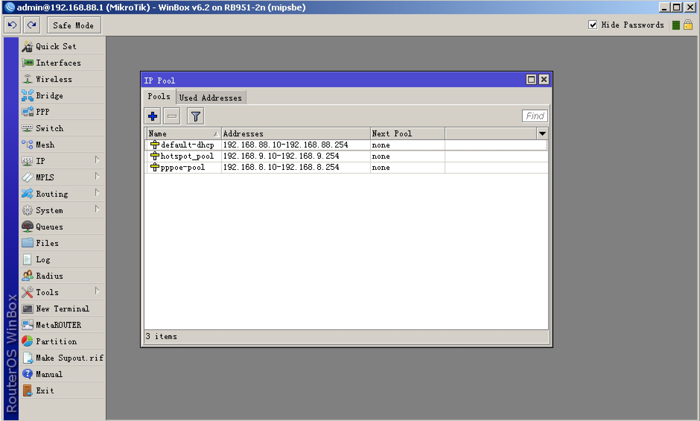

Radius设置
^^^^^^^^^^^^^^^

新建Radius服务配置，勾选你需要的服务，比如ppp针对客户端pppoe拨号，hotspot针对web认证,填写Radius服务器地址，以及对应的共享密钥，端口信息。

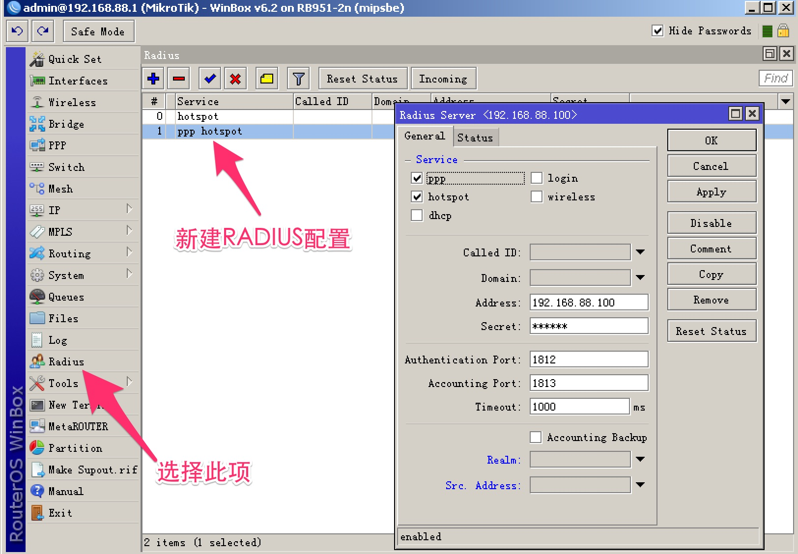

如果你打算启用COA功能，你必须启用这个服务端口，COA是一个很有用的功能，它可以实现动态策略下发，以及Disconnect Message功能。

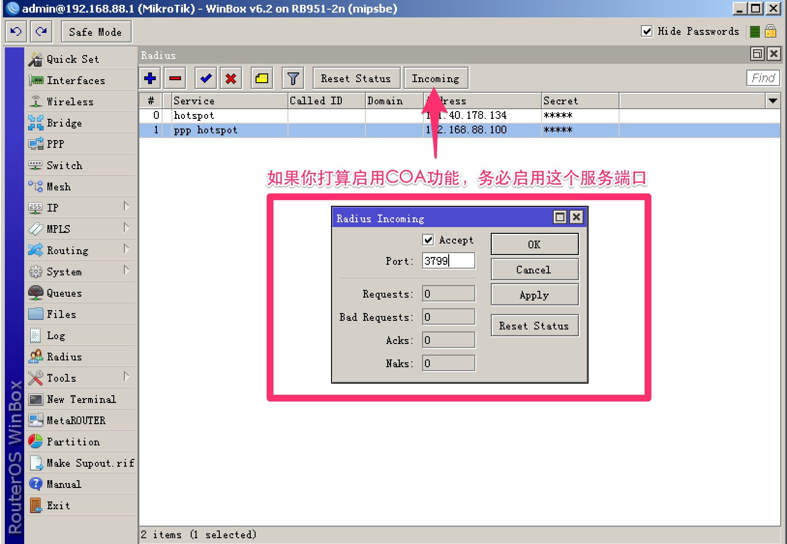

Hotspot设置
^^^^^^^^^^^^^^^

新建一个Hotspot服务配置，为Hotspot服务分配IP地址

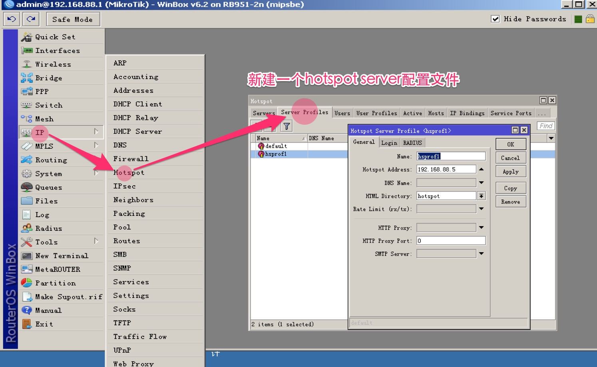

选择认证加密模式，chap比pap要安全的多，在Radius支持的情况下，最好选择它。

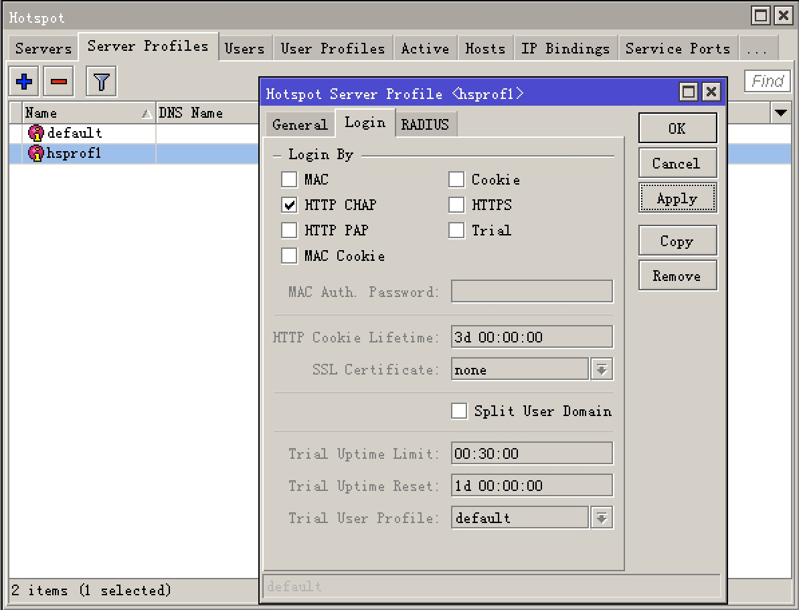

启用Radius，启用记账功能，如果你提供了时长计费的功能，为记账更新消息设置一个合理的间隔，比如一分钟，对于时长资费的用户，意味着每分钟扣费一次。

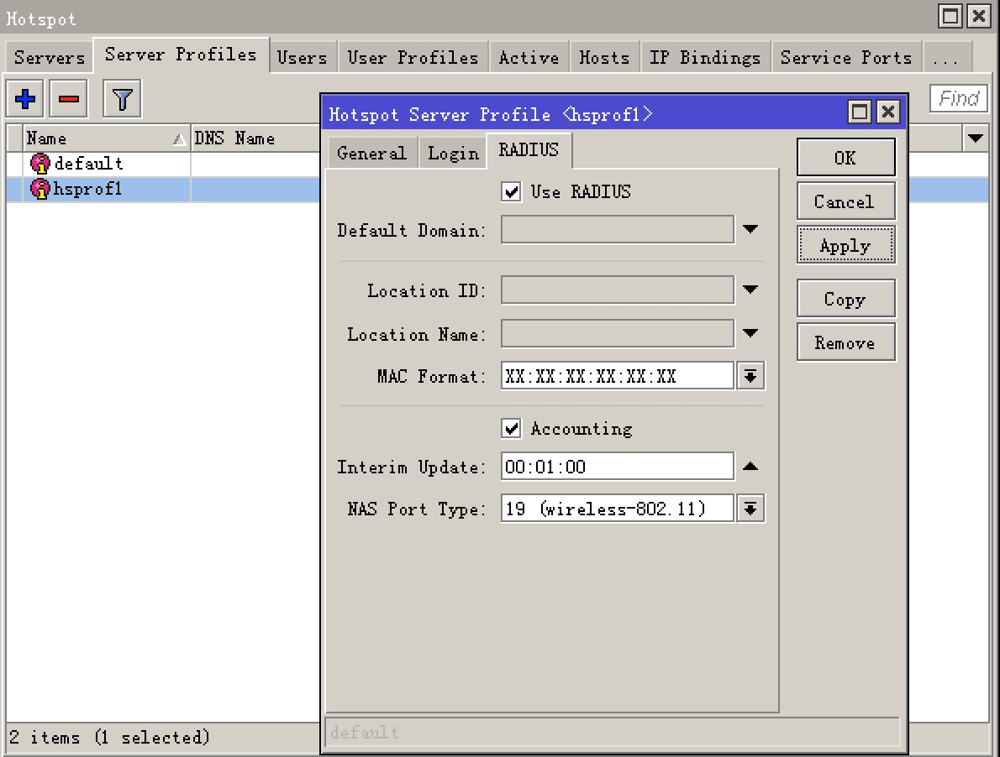

配置hotspot服务器，分配接口与地址池,通常设置Hotspot接口为wlan或bridge-local。

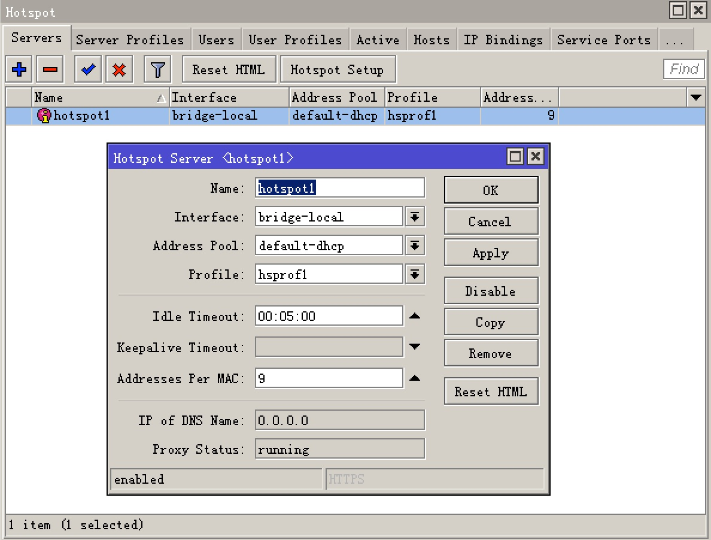

配置hotspot免认证IP列表，加入你的RADIUS服务器地址。

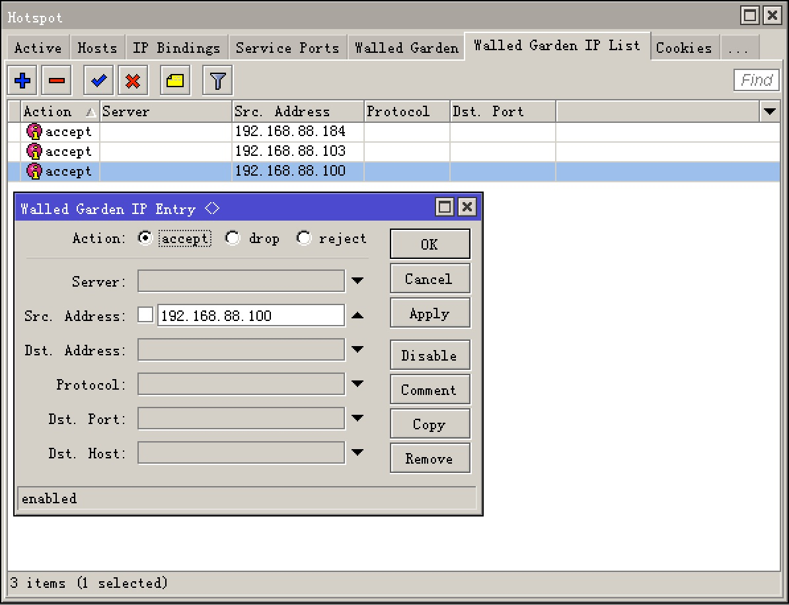

到此Hotspot配置完成，接下来通过终端（无线或有线）连接ROS路由器，访问任何网址会强制重定向到hotspot认证界面。不过，我们还需要配置好ToughRADIUS，才能开始认证。

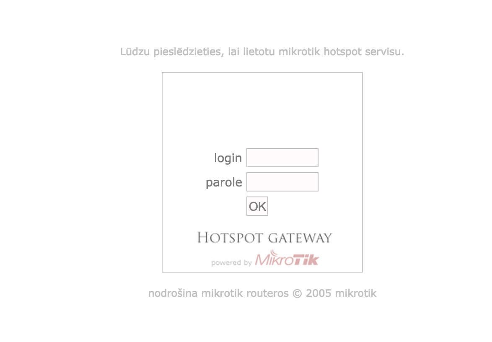

ToughRADIUS配置
---------------------------

关于ToughRADIUS的安装配置，请参考对应操作系统的安装手册。

BAS信息配置
^^^^^^^^^^^^^^^

在ToughRADIUS的BAS信息管理功能中，加入配置好的RouterOS路由器地址信息。

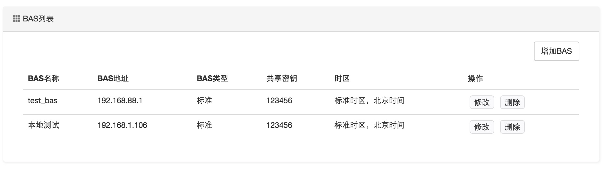

资费配置
^^^^^^^^^^^^^^^

在ToughRADIUS的资费信息管理中，加入资费信息，关于更多有关资费的描述，请参见ToughRADIUS相关的资费定义部分。

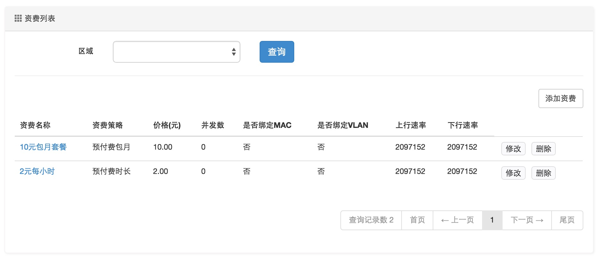

认证用户开户
^^^^^^^^^^^^^^^

通过ToughRADIUS的开户功能增加认证用户，选择相应资费，完成用户资料录入。

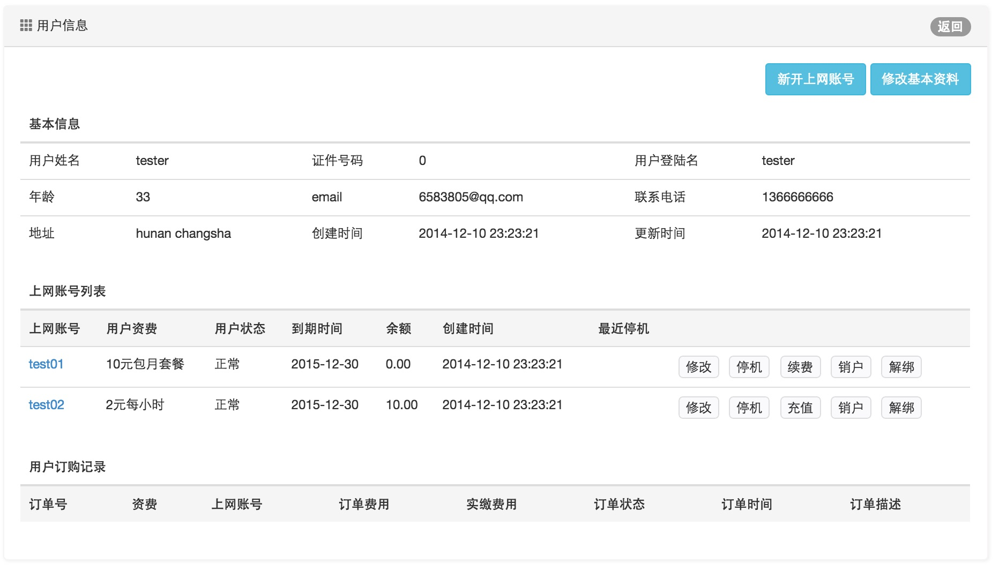

用户认证测试
---------------------------

完成了以上配置管理，现在，可以证实登陆认证了，进入web认证界面，输入radius中新开的用户账号和密码。

以下是包月资费用户：

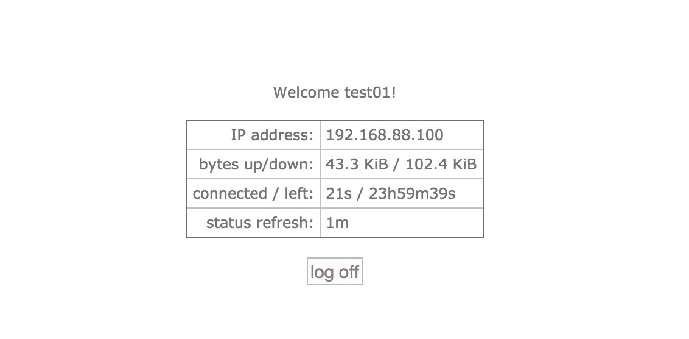

以下是时长用户：

由于测试的用户余额只能使用5小时，因此ToughRADIUS下发了最大5小时的时长，5小时后，用户会自动断开

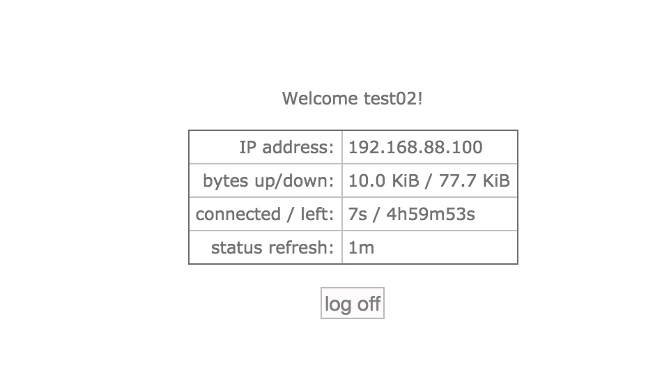

对于时长用户，ToughRADIUS会根据扣费周期实时扣费，并提供详细的扣费记录。

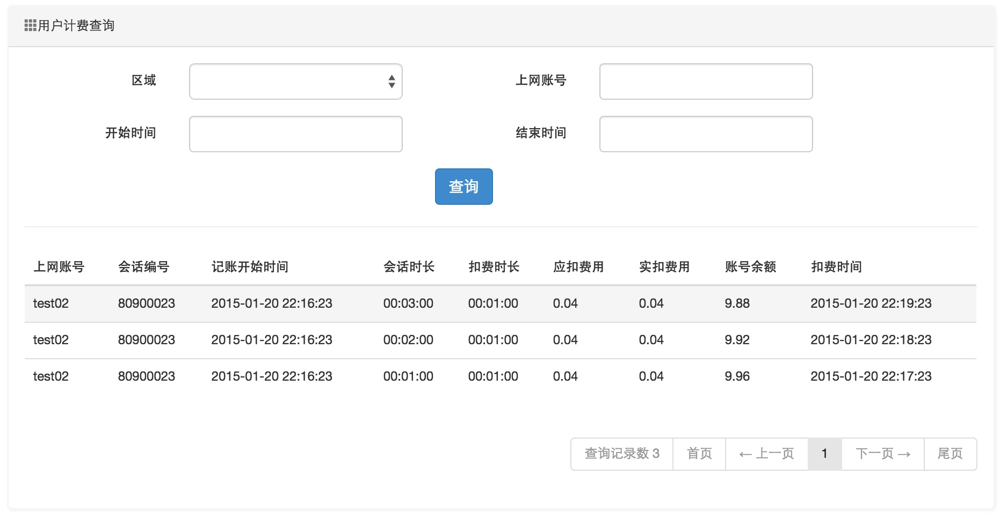

在线查询
^^^^^^^^^^^^^^^

用户认证成功上线后，在线查询可以查到当前所有在线用户列表，对于时长用户会显示已记账时间。

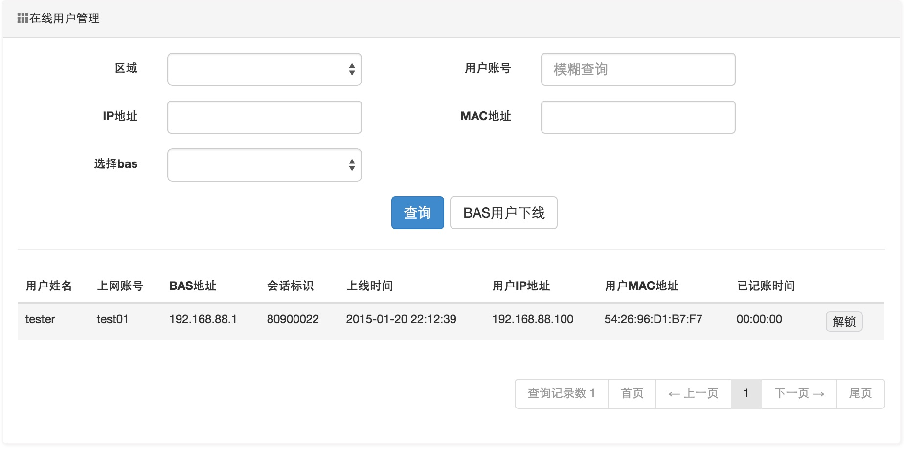

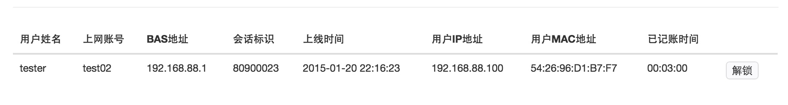

上网日志
^^^^^^^^^^^^^^^

用户下线后，会生成上网日志并提供查询

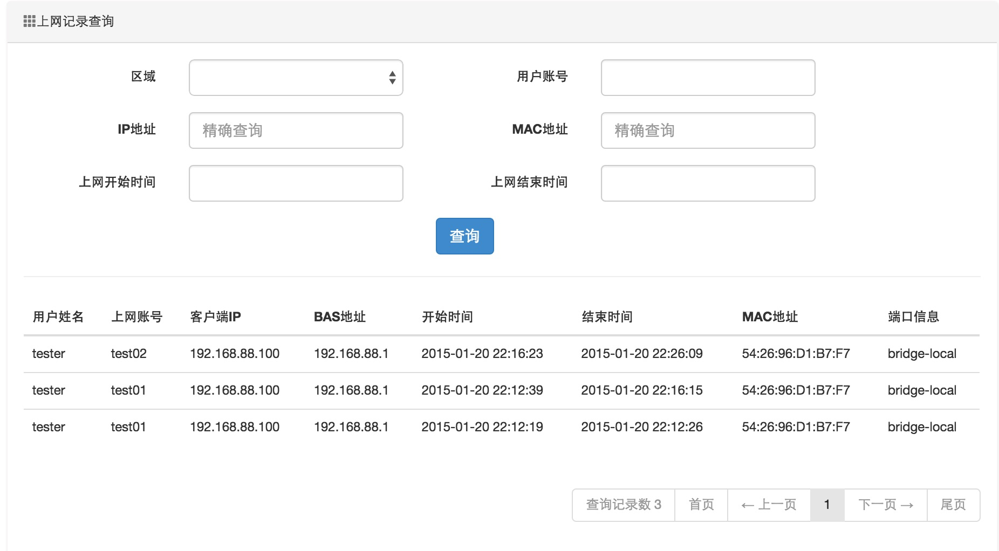