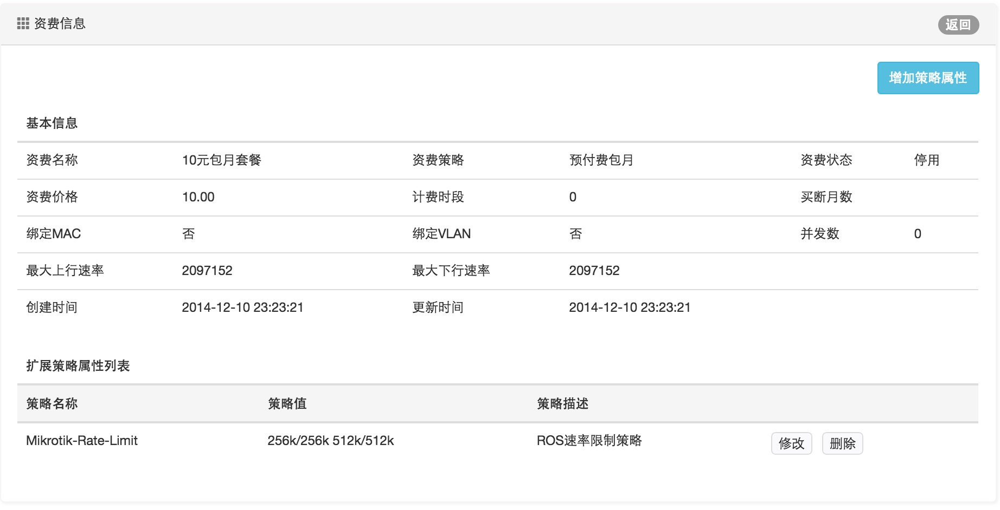
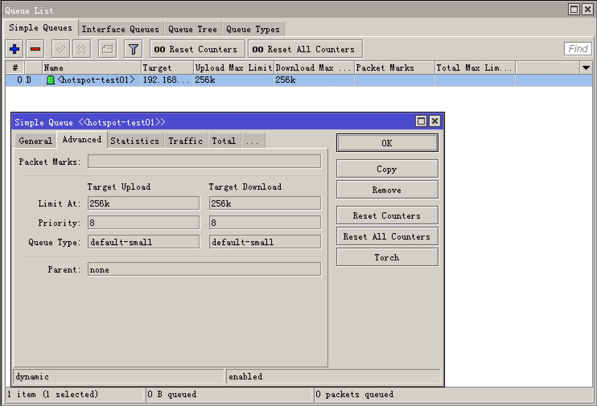

ToughRADIUS与RouterOS对接之下发策略扩展
===========================================

在ToughRADIUS中通过标准模式与Ros对接可以很容易的实现用户认证，内建的并发数控制，MAC绑定可以起到一定的上网控制作用，但是要实现精细化的策略管理，还需要靠扩展机制来实现，首先我们需要清楚，RouterOS提供了哪些私有策略。

在dictionary.mikrotik文件中（请参见radiusd/dict目录）的定义如下：

::

    VENDOR		Mikrotik			14988

    BEGIN-VENDOR	Mikrotik

    ATTRIBUTE	Mikrotik-Recv-Limit			1	integer
    ATTRIBUTE	Mikrotik-Xmit-Limit			2	integer

    # this attribute is unused
    ATTRIBUTE	Mikrotik-Group				3	string

    ATTRIBUTE	Mikrotik-Wireless-Forward		4	integer
    ATTRIBUTE	Mikrotik-Wireless-Skip-Dot1x		5	integer
    ATTRIBUTE	Mikrotik-Wireless-Enc-Algo		6	integer
    ATTRIBUTE	Mikrotik-Wireless-Enc-Key		7	string
    ATTRIBUTE	Mikrotik-Rate-Limit			8	string
    ATTRIBUTE	Mikrotik-Realm				9	string
    ATTRIBUTE	Mikrotik-Host-IP			10	ipaddr
    ATTRIBUTE	Mikrotik-Mark-Id			11	string
    ATTRIBUTE	Mikrotik-Advertise-URL			12	string
    ATTRIBUTE	Mikrotik-Advertise-Interval		13	integer
    ATTRIBUTE	Mikrotik-Recv-Limit-Gigawords		14	integer
    ATTRIBUTE	Mikrotik-Xmit-Limit-Gigawords		15	integer
    # MikroTik Values

    VALUE	Mikrotik-Wireless-Enc-Algo	No-encryption		0
    VALUE	Mikrotik-Wireless-Enc-Algo	40-bit-WEP		1
    VALUE	Mikrotik-Wireless-Enc-Algo	104-bit-WEP		2

    END-VENDOR	Mikrotik
    
我们可以用中文稍微解释下::

    Mikrotik-Recv-Limit  从客户端收到报文总字节数限制,可以用于基于流量记费.
    Mikrotik-Xmit-Limit  发给客户端收到报文总字节数限制,可以用于基于流量记费.
    Mikrotik-Group 用户组,在使用radius认证Mikrotik管理用户时可以用该属性返回用户属于full组还是其他组.
    Mikrotik-Wireless-Forward  转发项,当radius将该属性值=0返回给Mikrotik时,Mikrotik无线客户端的帧不转发到infrastructure
    Mikrotik-Wireless-Skip-Dot1x  802.1x认证选项,radius将不等于0的该属性值返回给Mikrotik时,Mikrotik对该无线客户忽略802.1x认证.
    Mikrotik-Wireless-Enc-Algo WEP加密算法。0 表示不加密, 1 表示40-bit WEP, 2 表示104-bit WEP (Wireless only)
    Mikrotik-Wireless-Enc-Key WEP 加密 key 
    Mikrotik-Rate-Limit  客户的速率限制。字符串表示，格式为 rx-rate[/tx-rate] [rx-burst-rate[/tx-burst-rate] [rx-burst-threshold[/tx-burst-threshold] [rx-burst-time[/tx-burst-time] [priority] [rx-rate-min[/tx-rate-min]]]] 
    其中，[]中内容表示可选。"rx" 表示客户的上传速率，"tx"客户的下载速率。burst-rate突发速率，burst-threshold突发门限，burst-time突发时长。
    Mikrotik-Realm  帐号域名后缀。
    Mikrotik-Host-IP HOTSPOT客户端最初始的IP地址
    Mikrotik-Mark-Id  防火墙magle链名。只用于HOTSPOT。
    Mikrotik-Advertise-URL 通知页面地址（URL）。一般用于HOTSPOT
    Mikrotik-Advertise-Interval URL通告时间间隔
    Mikrotik-Ascend-Client-Gateway HOTSPOT应用中，DHCP地址池中客户端的网关地址。  
    Mikrotik-Ascend-Data-Rate 类似与rate-limit但该属性被rate-limit忽略
    Mikrotik-Ascend-Xmit-Rate  下载速率限制但该属性被rate-limit忽略

在ToughRADIUS中中我们可以通过资费的扩展策略来实现，比如，我们定义一个简单速率策略

在ROS中查看认证成功后的速率限制,看起来速率策略下发成功了。

在实际运营中根据需要，你可以通过这种方式实现灵活的扩展。