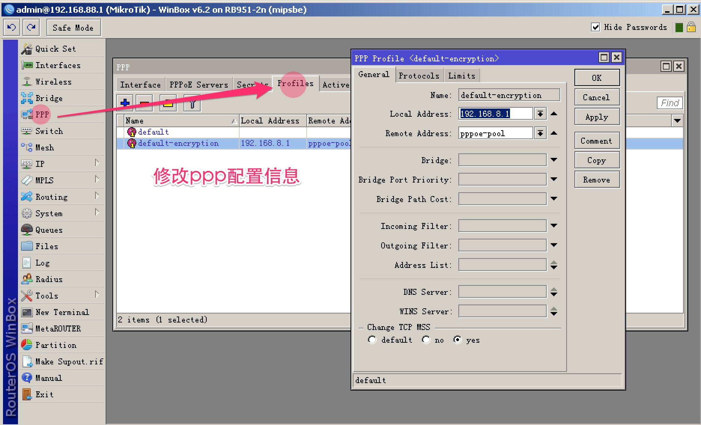
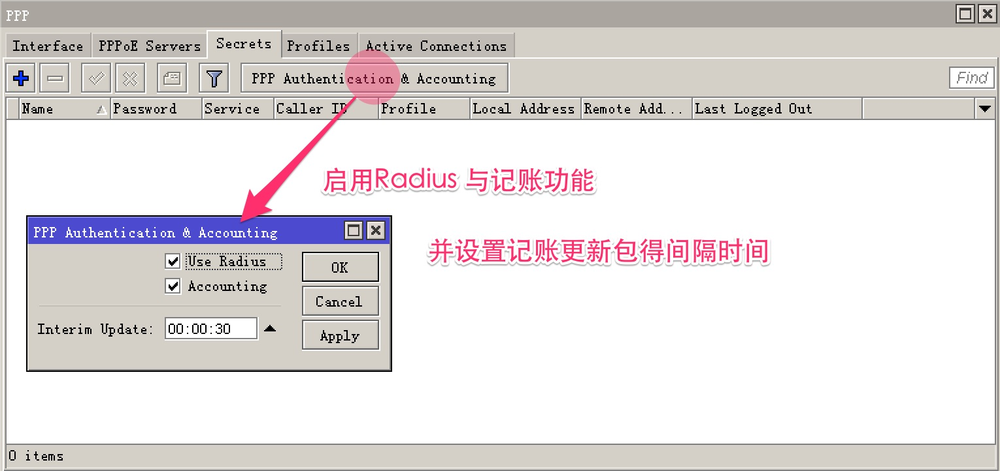
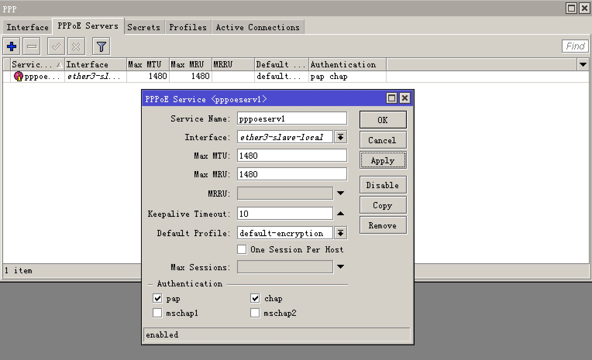

ToughRADIUS与RouterOS对接之PPPOE Server配置
================================================

使用RouterOS提供PPPOE拨号上网服务，并结合ToughRADIUS实现认证计费，大部分与Hotspot大同小异，本节内容主要讲述在RouterOS中的PPPOE Server配置部分。

定义ppp profile,填写本地地址和远程地址，其他根据实际情况进行配置。

在secret选项卡中启用Radius服务，选择记账功能以及输入记账更新消息的间隔，这对于时长资费有效。

配置pppoe server，选择接口，profile以及加密模式,对于会话（session）控制，可以通过Radius来做，这里不用选择。

完成以上配置，可以使用终端拨号测试一下了，ToughRADIUS中BAS，资费与用户的配置请参见Hotspot对接部分，这里不再讲述。