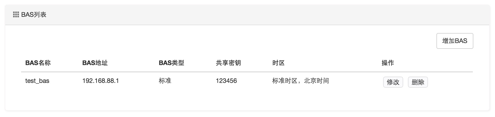
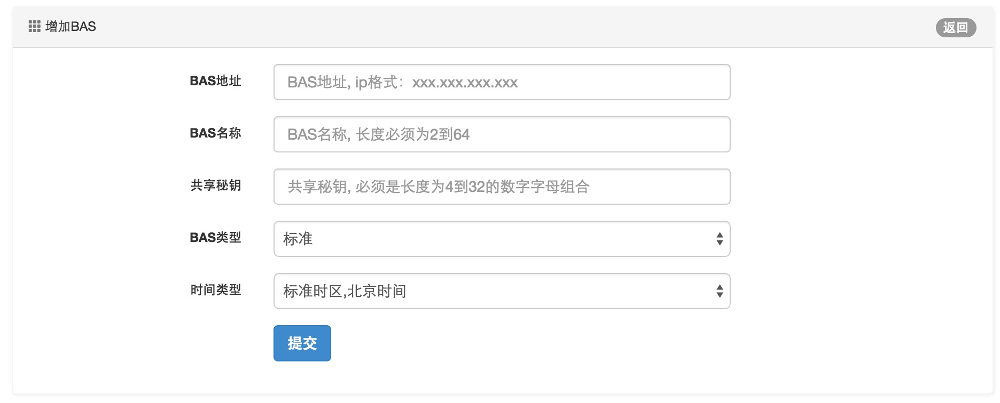

BAS设备管理
====================================

BAS设备对应这实际的物理接入网关设备，是具备PPPOE Server功能的路由器或交换机等设备。

BAS设备以IP地址为唯一标识，每个BAS与RadiusServer配置对应的共享密钥。

ToughRADIUS支持标准的Radius协议接入，通常大多数BAS设备可以以标准类型配置。但是对于很多厂家的BAS设备，在标准协议下并不能工作的很完美，比如MAC地址，VLAN往往以各自的私有协议封装，RadiusServer为了准确的处理这些信息，必须对这些BAS设备进行类型标识，并在消息处理时进行解析。

ToughRADIUS对各个厂家私有协议处理是可扩展的，通过编写插件可以实现更多的厂家扩展支持。

*BAS管理界面*：

*BAS配置界面*：

