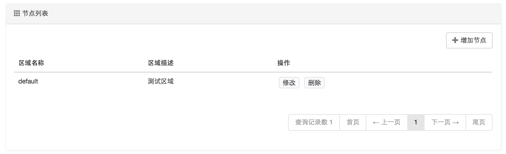
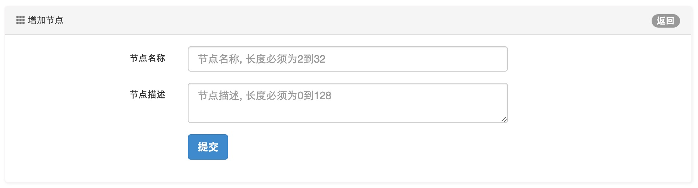

区域管理
====================================

区域是用来对用户进行业务逻辑划分的，区域的定义比较灵活，既可以使用与位置相关的定义，也可以使用与资费类型相关的定义。

比如对于一个小区，可以定义1单元，2单元这样的区域；对于一个网吧，可以定义为游戏区，视频区等。

区域对于业务统计，数据分析显得很有意义。

同时可以通过区域来实现操作员权限控制，每个操作员只能管理某个区域下的数据。

*区域管理界面*：

*区域配置界面*：

