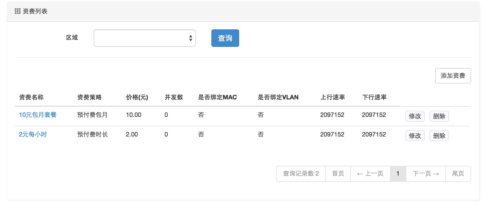
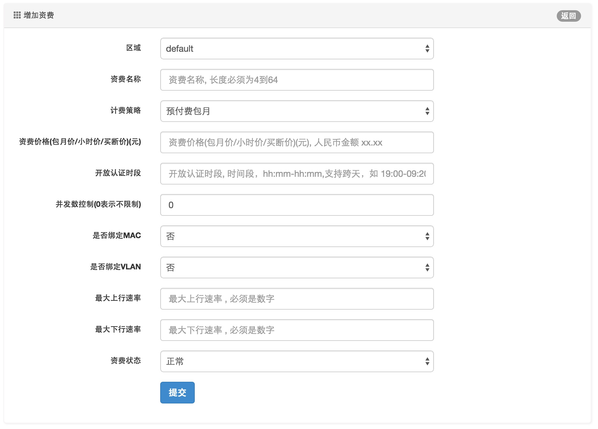
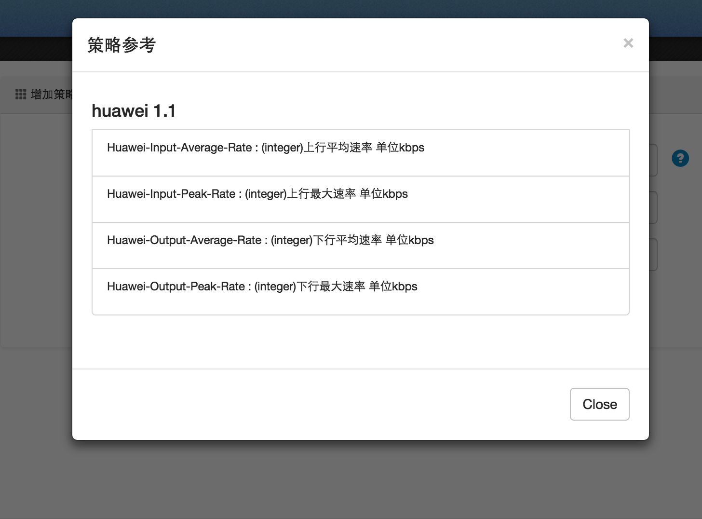
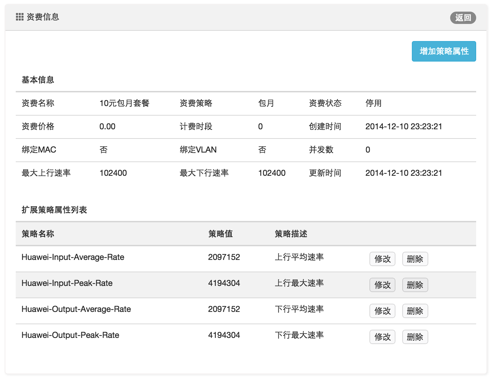

资费管理
====================================

资费是对计费规则的定义，决定了对每个上网账号如何收费，如何扣费的规则。

*资费管理界面*：

*资费配置界面*：

*资费属性说明*：

+ 资费名称：资费规则文字说明

+ 资费策略：系统支持(预付费买断包月/按小时计费) 计费策略，预付费包月是先缴费后使用的模式，用户缴纳一定的费用买断一定的（自然月）时长。用户上网账号会有一个过期时间，当过了该日期后，用户的上网账号就失效，需要续费才能使用，适用于时间地点比较稳定的用户。按小时计费是一种较短的周期计费模式，一般定义为每小时单价，扣费周期为1分钟，没使用一分钟则扣费一分钟的费用，是一种相对灵活的计费方式，适用于时间地点不固定的用户。

+ 买断月数：只对买断包月资费有效，表示打包买断的月数。 

+ 资费价格：对于预付费包月类型，价格是自然月单价；预付费时长类型，价格是小时单价；买断包月类型，价格是打包资费的总价。

+ 开放认证时段：表示在指定的时段内开放认证服务，适用于一些特殊的运营单位，比如学校通常会在晚上休息时间对学生关闭认证上网服务。格式如 hh:mm-hh:mm,支持跨天，如 23:00-06:00

+ 用户并发数：限制用户可以拨号的客户端数量（0表示不限定|并发数不能超过20） 

+ 是否绑定MAC地址：设置用户认证后是否绑定MAC，设置绑定后，用户只能用唯一客户端拨号上网。
+ 是否绑定VLAN/QINQ： 设置是否绑定用户拨号区域的VLAN，如果绑定的话，用户无法在其他区域拨号上网。  

+ 上行最大速率：标准上行限速（单位:bps,2M=2097152）

+ 下行最大速率：标准下行限速（单位:bps,4M=4194304） 

资费策略扩展：
--------------------

在处理策略下发的过程中，经常会涉及到不同BAS接入设备的私有属性扩展，最常见的如限速策略，标准的上行速率和下行速率并不总是能满足要求，不同厂家在限速策略上各有不同的协议特征。不过通过资费绑定扩展策略属性可以很好地解决这一问题。

比如华为RADIUS1.1规范里有四个典型的扩展属性：

> Huawei-Input-Average-Rate : (integer)上行平均速率 单位kbps

> Huawei-Input-Peak-Rate : (integer)上行最大速率 单位kbps

> Huawei-Output-Average-Rate : (integer)下行平均速率 单位kbps

> Huawei-Output-Peak-Rate : (integer)下行最大速率 单位kbps

在ToughRADIUS管理系统中，只需要将这几个属性与资费进行绑定，当订购该资费的用户认证成功后，就会下发这几个属性。

策略配置使用技巧
--------------------

各个不同BAS设备厂家都提供了协议字典参考文件，ToughRADIUS系统的radiusd/dict目录下默认放置了常见厂家的Radius协议字典，如果其中没有你使用的设备的radius协议字典，请从相关网站下载字典文件加入此目录，比如增加ros的字典文件dictionary.mikrotik，同时在dictionary中加入 $INCLUDE dictionary.mikrotik。

ToughRADIUS系统的console/lib目录下有个radius_attrs.py文件，你可以编辑该文件，加入你常用的字典属性。

格式如下::

    #coding:utf-8
    radius_attrs = {
      'huawei 1.1':[
         {
            'attr_name':'Huawei-Input-Average-Rate',
            'attr_desc':u'(integer)上行平均速率 单位kbps'
         },
         {
            'attr_name':'Huawei-Input-Peak-Rate',
            'attr_desc':u'(integer)上行最大速率 单位kbps'
         },
        {
            'attr_name':'Huawei-Output-Average-Rate',
            'attr_desc':u'(integer)下行平均速率 单位kbps'
         },
         {
            'attr_name':'Huawei-Output-Peak-Rate',
            'attr_desc':u'(integer)下行最大速率 单位kbps'
         }
      ]
    }

完成后，在资费扩展属性配置表单界面，你可以获得一个快捷的参考提示，如图：

一个典型的资费配置，如图：

.. topic:: 注意

    当资费与特定设备的策略属性绑定后，它总是适用于该设备，如果改变了其他类型的设备后，下发这些策略属性将会失效。

