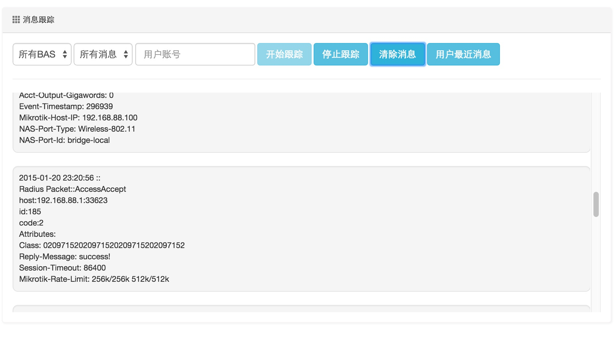

ToughRADIUS消息跟踪，故障诊断
====================================

ToughRADIUS消息跟踪是一个非常有用以及易用的功能，对于用户认证691错误的诊断有很大帮助。

在web管理界面可以实时跟踪radius消息，而不用在终端下进行，让很多非专业的人员也能操作。

除了实时跟踪，也可以查询单个用户最近时间的消息，用于离线诊断。

.. image:: ../_static/images/radius_user_trace2.jpg
