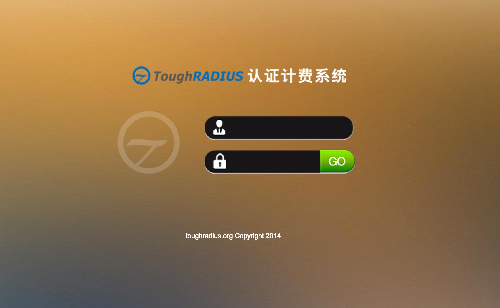

ToughRADIUS在windows下的安装配置
====================================

ToughRADIUS为windows提供了一个快速部署的模式，帮助使用者快速部署ToughRADIUS服务。

最新版本下载
--------------------------------

从以下链接可以下载最新的ToughRADIUS版本：

`github.com mirror <https://github.com/talkincode/ToughRADIUS/archive/master.zip>`_

`coding.net mirror <https://coding.net/u/jamiesun/p/ToughRADIUS/git/archive/master>`_

`oschina.net mirror <https://git.oschina.net/jamiesun/ToughRADIUS/repository/archive?ref=master>`_

数据库安装配置
--------------------------------

ToughRADIUS主要采用MySQL(5.0以上版本)存储数据，在部署ToughRADIUS之前请自行安装MySQL（安装步骤请参考MySQL相关文档）,安装MySQL后确保MySQL为运行状态。

+ 修改配置文件 config.json中的mysql选项,请修改数据库地址用户名密码等选项与实际相符。

.. code-block:: javascript

    "database": 
    {
        "dbtype":"mysql",
        "maxusage": 10, 
        "passwd": "radius",
        "charset": "utf8", 
        "db": "toughradius",
        "host": "192.168.59.103",
        "port": 3306,
        "user": "admin"
    },

+ 运行createdb.bat创建数据库表，ToughRADIUS采用脚本工具自动创建数据库，无需SQL脚本。

在windows环境下，双击createdb.bat即可进行数据库创建过程。

.. code-block:: bash

    createdb.bat

    #按提示进行操作

    Z:\github\ToughRADIUS>toughrad.exe createdb.py  -c config.json  || pause

    starting create and init database...

    drop and create database ?[n]y

    init database ?[n]y

.. topic:: 注意

    运行脚本会尝试删除原有数据库并重建，如果非首次安装，建议备份数据。

应用配置说明
-------------------------------

在config.json文件中，可以指定几乎所有的配置参数。

databse部分是数据库的配置，修改配置文件数据库部分的主机，端口，用户名，数据库名，密码和实际相符合。

radiusd是Radius核心服务的配置，注意adminport是提供给web管理系统调用服务的端口，allows主要是web管理系统与自助服务系统的IP地址。

admin部分是web管理控制台配置，注意服务端口的配置，如果与系统其他应用冲突请修改。

customer是自助服务系统配置，注意服务端口的配置，如果与系统其他应用冲突请修改。

.. code-block:: javascript

    {
        "database": 
        {
            "dbtype":"mysql",
            "maxusage": 10, 
            "passwd": "radius",
            "charset": "utf8", 
            "db": "toughradius",
            "host": "192.168.59.103",
            "port": 3306,
            "user": "admin"
        },
        "radiusd":
        {
            "authport": 1812,
            "acctport": 1813,
            "adminport": 1815,
            "allows":"192.168.88.100,192.168.88.100",
            "dictfile": "./radiusd/dict/dictionary",
            "debug":1,
            "cache_timeout":600
        },
        "admin":
        {
            "httpport":1816,
            "debug":1
        },
        "customer":
        {
            "httpport":1817,
            "debug":1
        }    
    }

运行radiusd服务
--------------------------------

radiusd提供提供了RADIUS核心认证计费授权服务，在windows环境下，双击radiusd.bat脚本即可运行。

radiusd.bat内容

.. code-block:: bash

    toughrad.exe radiusd/server.py -c config.json || pause   

运行web管理服务
--------------------------------

console是Web管理控制台系统，在windows环境下，双击console.bat脚本即可运行。

console.bat脚本内容

.. code-block:: bash

    cd console && ..\toughrad.exe admin.py -c ../config.json || pause

当启动web控制台服务后，就可以通过浏览器访问管理界面了，在浏览器地址栏输入：http://127.0.0.1:1816,默认的管理员密码为admin/root

登陆界面：

运行用户自助服务系统
--------------------------------

customer是Web自助服务系统，在windows环境下，双击customer.bat脚本即可运行。

customer.bat脚本内容

.. code-block:: bash

    cd console && ..\toughrad.exe customer.py -c ../config.json || pause

